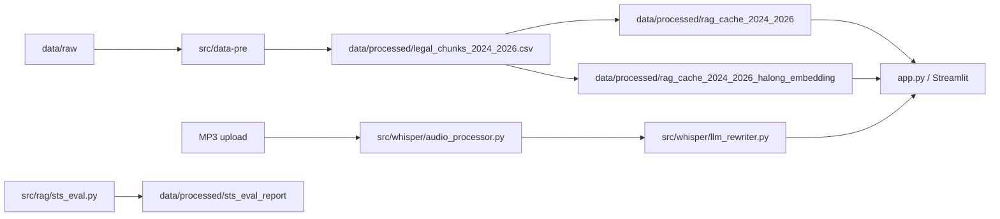

# Trợ lý Pháp luật AI

Ứng dụng Streamlit hỏi đáp pháp luật Việt Nam, chạy LLM local qua Ollama và so sánh 3 chế độ trả lời trên cùng một câu hỏi:

- Không RAG
- RAG với `keepitreal/vietnamese-sbert`
- RAG với `hiieu/halong_embedding`

App cũng hỗ trợ upload MP3, Whisper STT và chuẩn hóa câu hỏi bằng Ollama trước khi đưa vào RAG.



## Tính năng

- Chat tiếng Việt với cùng một LLM ở 3 chế độ trả lời.
- Hybrid RAG gồm BM25, FAISS HNSW/IVF và CrossEncoder reranking.
- Hiển thị nguồn tham chiếu từ các chunk pháp luật.
- Nhận câu hỏi từ file MP3 qua Whisper STT.
- Chuẩn hóa câu hỏi bằng một Ollama rewriter local.
- Có notebook STS để so sánh chất lượng hai embedding RAG.

## Cấu trúc chính

```text
.
├── app.py
├── configs/
│   └── rag/
│       ├── chunking.yaml
│       └── vector_db.yaml
├── data/
│   ├── raw/
│   └── processed/
├── notebooks/
│   └── sts_eval_analysis.ipynb
├── src/
│   ├── data-pre/
│   ├── rag/
│   │   ├── chunking.py
│   │   ├── embedding.py
│   │   ├── llm.py
│   │   ├── sts_eval.py
│   │   └── vector_db.py
│   ├── ui/
│   │   └── gemini_client.py
│   └── whisper/
│       ├── audio_processor.py
│       └── llm_rewriter.py
├── tests/
│   └── test_gemini_client.py
└── requirements.txt
```

## Cài đặt

```bash
conda activate dl
pip install -r requirements.txt
```

Whisper cần `ffmpeg`. Trên conda có thể cài bằng:

```bash
conda install -n dl -c conda-forge ffmpeg
```

Ứng dụng chính dùng Ollama local. Hãy cài Ollama và pull model được khai báo trong `configs/rag/vector_db.yaml`:

```bash
ollama pull qwen2.5:7b
```

Nếu muốn dùng `src/ui/gemini_client.py` hoặc chạy test liên quan, tạo file `.env` ở thư mục gốc với:

```env
api_key=YOUR_GEMINI_API_KEY
```

## Chạy ứng dụng

```bash
conda activate dl
streamlit run app.py
```

Mở trình duyệt tại `http://localhost:8501`.

## Tạo lại dữ liệu và cache RAG

Nếu muốn tái tạo từ dữ liệu nguồn, chạy theo thứ tự sau:

```bash
# Chunk hóa văn bản pháp luật
python src/rag/chunking.py --config configs/rag/chunking.yaml

# Build cache RAG mặc định: keepitreal/vietnamese-sbert
python src/rag/vector_db.py --config configs/rag/vector_db.yaml

# Build cache RAG với Halong embedding
python src/rag/vector_db.py --config configs/rag/vector_db.yaml --cache-dir-key cache_dir_halong --encoder-key encoder_halong
```

Nếu cần build lại từ đầu, thêm `--rebuild-cache`. Có thể test truy xuất bằng `--query "..."`.

## Đánh giá STS

Repo có script và notebook để đánh giá semantic similarity giữa output tham chiếu và hai biến thể RAG:

```bash
python src/rag/sts_eval.py --input data/processed/legal_valid.json --output data/processed/legal_valid_sts_eval.json --csv-out data/processed/sts_eval_report/legal_valid_sts_eval.csv
```

Phân tích trực quan nằm trong `notebooks/sts_eval_analysis.ipynb`.

## Kiểm thử

```bash
pytest tests/test_gemini_client.py -v
```

## Ghi chú

- Repo hiện đã có sẵn nhiều artifact trong `data/processed/`, nên thường chỉ cần cài dependencies, đảm bảo Ollama đang chạy và mở `app.py`.
- App mặc định so sánh hai cache RAG: `cache_dir` và `cache_dir_halong` theo cấu hình trong `configs/rag/vector_db.yaml`.
