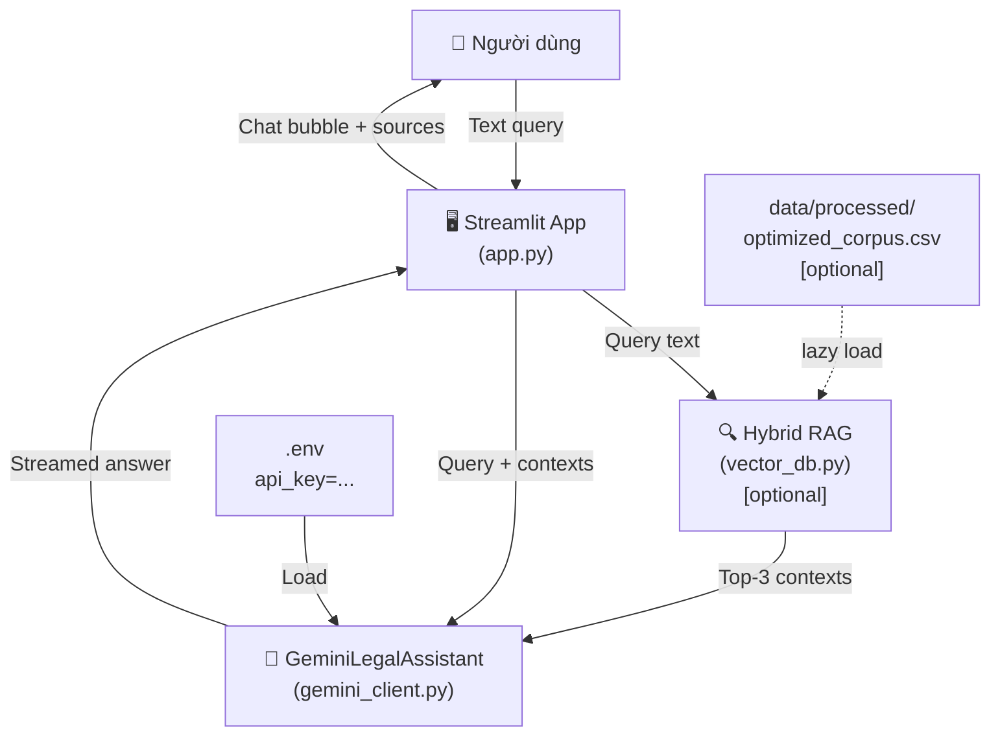

# System Design — Streamlit Chat UI

## Architecture Overview



**Key components:**
- `app.py` — Entry point Streamlit, quản lý UI, session state và chat loop
- `src/ui/gemini_client.py` — Wrapper gọi Gemini 2.5 Flash với RAG context + multi-turn history
- `src/rag/vector_db.py` — HybridRAGSystem, load lazy khi data CSV tồn tại

## Data Models

**Session State (Streamlit):**
```python
st.session_state.messages = [
    {"role": "user", "content": "vượt đèn đỏ phạt bao nhiêu?"},
    {"role": "assistant", "content": "Theo Nghị định 100/2019...", "sources": ["Điều 6..."]}
]
# rag: HybridRAGSystem | None (None khi chưa có data CSV)
```

**Chat Message:**
```python
{
    "role": "user" | "assistant",
    "content": str,
    "sources": list[str] | None,  # chỉ cho assistant
}
```

## API Design

**Gemini Client Interface:**
```python
class GeminiLegalAssistant:
    def __init__(self, api_key: str)
    def answer(self, query: str, contexts: list[str] = []) -> str
```

**RAG Integration:**
- Nếu `data/processed/optimized_corpus.csv` tồn tại → load RAG và lấy top-3 context
- Nếu không tồn tại → dùng Gemini thuần (zero-shot)

## Component Breakdown

### Frontend (Streamlit)
- **Header:** Gradient title "🚦 Trợ lý Pháp lý AI"
- **Sidebar:**
  - RAG status badge (🟢 hoạt động / 🟡 chưa có dữ liệu)
  - Metrics: số câu hỏi, trạng thái RAG
  - Nút xóa lịch sử
- **Welcome Screen:** Gợi ý câu hỏi mẫu (khi chưa có chat)
- **Chat Area:** `st.chat_message` bubble — user avatar 🧑‍💻, assistant ⚖️
- **Input Bar:** `st.chat_input()` — text only
- **Source expander:** Accordion "📚 Nguồn tham chiếu" trong bubble assistant

### Backend Modules
- `GeminiLegalAssistant` — `@st.cache_resource`, multi-turn history, streaming
- `HybridRAGSystem` — `@st.cache_resource`, lazy-load khi CSV tồn tại

## Design Decisions

| Quyết định | Lựa chọn | Lý do |
|-----------|----------|-------|
| LLM Backend | `google-genai` SDK v2 (gemini-2.5-flash) | API key có sẵn; SDK mới, `google-generativeai` deprecated |
| Input | Text only | Whisper + OCR nằm ngoài phạm vi (skip) |
| State Management | `st.session_state` | Built-in Streamlit, đủ cho POC |
| RAG load | `@st.cache_resource` + lazy init | Tránh reload model mỗi rerun; graceful khi không có data |
| LLM history | Lưu trong `GeminiLegalAssistant._history` | Multi-turn context cho hội thoại tự nhiên |
| Streaming | `generate_content_stream` | Typewriter effect, UX mượt hơn |

## Non-Functional Requirements

- **Startup time:** < 5 giây (không tính load model lần đầu)
- **Response time:** < 10 giây (Gemini API + RAG)
- **UI:** Responsive, dark-mode friendly với Streamlit theme
- **Error handling:** Graceful fallback khi RAG data chưa có
